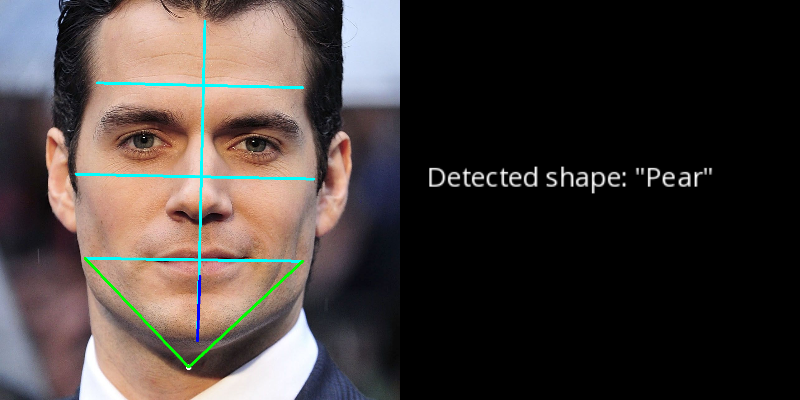

# Facial Shape Detection

## __Introduction:__  

   In the Project, we are about to perform facial shape detection with **mediapipe** python.

## __Project Description__

Root directory of this project contains:
>
> - **2 sub-folders**
> - **several [.py] files**
> - **1 text files containing all the requirements of this project**
> - **1 readme.md file containing all the necessary instructions.**
> - **Some test image examples in `test_images` folder**

Details about the folders and files:
 >
 > - **test_images(folder):**  Contains some test images to test out our algorithm.  
 > - **output(folder):** Contains the resultant images got from the model.

 > - **output(folder):** Contains all the output that we got from the trained model. Outputs contain-
 >
 > - **detect_face_shape.py**: By placing all the images in our `test_images` folder, this script analyze all the images and save the output in `output` folder.
 > - **detect_face_shape_single.py**: Given a single image from our `test_images` folder, this script analyze that particular image and save the output in `output` folder.

>
### __Instructions:__

> Before starting we need to satisfy all the dependencies. For that reason need to execute the following command. (All the commands need to be executed from the root folder)
>
> - __Install the dependencies:__  
>> `pip install -r requirements.txt`  

> To detect facial shapes from multiple images at once, run the following command:
>
> >`python detect_face_shape.py`  

> To detect facial shape from a single image, run the following command:  
>> `python detect_face_shape_single.py --input_path test_images/<img_name>.jpg --display_output False`
>
>
>>__**Example command:**__  
>> `python detect_face_shape_single.py --input_path test_images/B1.jpg --display_output False`

>

__Resultant image from our algorithm:__

